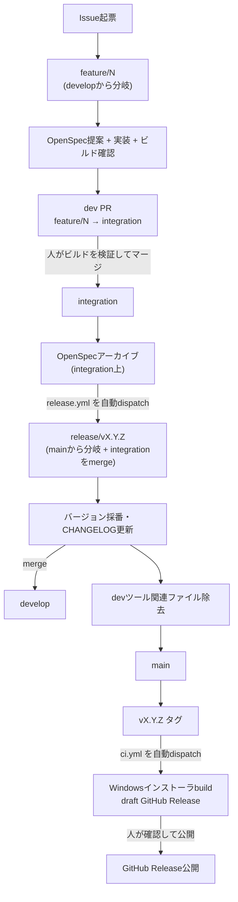

# ブランチ・リリース戦略

## 1. 目的

この文書は、Interview-Assistant のブランチ運用、バージョン管理、リリース作成、GitHub Actions によるビルド成果物公開の方針を整理するための資料である。

このプロジェクトは当面個人利用を前提とするため、過度に複雑にしない運用を目指す。

Issue 起票から PR 承認・OpenSpec アーカイブまでの **開発フロー** は [Issue駆動開発フロー](Issue駆動開発フロー.md) を参照する。本資料は、OpenSpec アーカイブ済みの状態から始まる **リリースフロー**（次バージョンの想定、`release/v<version>` 作成、バージョン更新、GitHub Release 作成、タグ付け、安定ブランチ（main）へのマージ）を対象とする。

## 2. 前提

- 当面は開発者本人の個人利用を前提とする
- 第三者配布、SaaS 化、商用提供は現時点では想定しない
- ただし、自分がインストールしやすいように GitHub Release へビルド成果物を添付したい
- GitHub Actions で Windows 向けインストーラを作成することを優先する
- macOS / Linux の成果物は、必要になった段階で対象に含める
- Pluely 由来の workflow や設定には、ライセンス、署名、updater、外部API secret 依存が残っている可能性がある

## 3. ブランチ戦略

ブランチ構成と、Issue起票からリリースまでのおおまかな流れは次のとおり（詳細は各節を参照）。



`feature/*` は `develop` から分岐し、`integration` へのdev PRで合流する（§3.3）。`integration` は初回のみ `develop` から作成し、以降は削除せず使い回す固定ブランチで、dev PRのマージ先とOpenSpecアーカイブの置き場を兼ねる（§3.4）。`release/*` は常に最新の `main` から分岐して `integration` を取り込む（§3.5）。バージョン採番・CHANGELOG更新を終えた時点の内容は `develop` にもマージし、`develop` を毎リリースで最新化する。緊急のビルド失敗・不具合対応も専用ブランチは設けず、通常の Issue駆動フロー（新しい Issue を起票し `feature/<N>` で対応する）に統一する（2026-09-04、旧 `hotfix/v<version>` ブランチを廃止）。`integration` へのdev PRマージ後のOpenSpecアーカイブから `main` マージ・タグ作成・ビルド起動までは `.github/workflows/release.yml`（§7）と `.github/workflows/issue-driven-dev.yml` が自動実行し、GitHub Releaseの最終確認・公開切り替えのみ人間が行う。

### 3.1 基本方針

以下のブランチ構成を候補とする。

- `main`: 安定ブランチ（本番相当）。`.claude`/`.codex`/`openspec`/`openwiki`/`docs`/`AGENTS.md`/`CLAUDE.md` など AI 開発ツール関連のファイルを含まない、リリース済みの最小構成を保つ
- `develop`: `feature/*` の分岐元となる長命ブランチ。AI 開発ツール関連のファイル一式（`.claude`/`.codex`/`openspec`/`openwiki`/`docs`/`AGENTS.md`/`CLAUDE.md`）を含む。毎リリースで `release/v<version>` からマージされ最新化される（§3.5）
- `integration`: dev PR（`feature/*` → `integration`）のマージ先であり、OpenSpec アーカイブの置き場を兼ねる固定ブランチ。初回のみ `develop` から作成し、以降は削除せず使い回す（§3.4）
- `feature/<name>`: 通常開発ブランチ。ビルド確認も `build/*` に分けず、この `feature/<name>` 自体に対して直接行う（§3.4）
- `release/v<version>`: リリース準備ブランチ。毎回 `main` から新規作成する使い捨てブランチ

緊急障害・ビルド失敗対応専用のブランチ（旧 `hotfix/v<version>`）は設けない。ビルドの失敗や不具合が見つかった場合も、新しい Issue を起票して通常の `feature/<name>` フローで対応する（2026-09-04、§3.7 参照）。

`develop` は 2026-08-22 から導入した。導入前は使っていなかったため、それ以前の記述・過去のコミット履歴には `develop` を前提としないものが残っている。`build/<name>` ブランチも同日に廃止した（§3.4）。`integration` は 2026-09-04 から導入した。それまで `develop` が兼ねていた「dev PR のマージ先」の役割を分離し、OpenSpec アーカイブ専用の固定ブランチとして新設したもの（詳細は§10変更履歴参照）。

### 3.2 現状との差分

現時点ではローカルと GitHub 側に `main` ブランチを作成済みである。

一方で、GitHub 側の default branch 切り替えや既存 `master` の扱いは別途決める必要がある。

- GitHub 側の default branch を変更するか
- 既存 `master` をいつどう扱うか

決定済み:

- 今後の資料や運用は `main` を安定ブランチとして扱う
- GitHub Actions は `main` push と `v<version>` tag push で起動する

推奨案:

- GitHub の default branch も `main` に変更する

### 3.3 feature ブランチ

通常の作業は `feature/<name>` で行う。

例:

- `feature/japanese-ui`
- `feature/personal-docs`
- `feature/release-workflow`
- `feature/local-llm`
- `feature/local-stt`

方針:

- `develop` から分岐する（`main` からではない）
- 1つの feature は、できるだけ1つの目的に絞る
- feature 完了・動作検証後は `integration` へマージしてよい（[Issue駆動開発フロー](Issue駆動開発フロー.md) の dev PR がその合流点であり、マージが OpenSpec アーカイブ実行の合図になる）。`feature/*` を安定ブランチ（`main`）へ直接マージしてはならない点は変わらない。`main` への push は種類を問わず（コード変更・ドキュメント整理・OpenSpec のアーカイブ等であっても）`publish` ワークフローを起動させるため、`main` への反映は必ず `release/v<version>` を経由し、バージョン更新・`CHANGELOG.md` 更新・タグ作成まで行う
- 個人利用前提のため厳密なレビュー運用は必須ではないが、変更内容は小さく保つ

### 3.4 ビルド確認（build ブランチは使わない）

以前は `feature/*` への毎コミットで重いビルドを走らせないよう、ビルド確認専用に `feature/<name>` をミラーする `build/<name>` ブランチを使っていたが、2026-08-22 に廃止した。ブランチ・PR が2本に増える割に得られる利点が薄いと判断し、`build.yml`（Tauri の実ビルド）を `feature/<name>` に対して直接 `workflow_dispatch` で実行する方式に変更した。実ビルドの頻度は変わらない（ビルド確認のたびに実行する点は同じ）が、ミラーブランチ用の中間 push が不要になる。詳細な使い方は [Issue駆動開発フロー](Issue駆動開発フロー.md) の「ビルド確認」「PR 作成」「ユーザー動作検証」を参照。

方針:

- `feature/<name>` を作成すると同時に、base=`integration` の draft PR を用意する（[Issue駆動開発フロー](Issue駆動開発フロー.md) 参照）。ビルドが成功したらこの PR にビルド済み成果物を添付し、Ready for review に切り替えて、ユーザーがダウンロードして動作検証できるようにする。この PR はソースコードの差分レビューを目的としたものではない
- ビルドの失敗、または動作検証での問題発見時は `feature/<name>` を修正して再度ビルドを実行する（成功・検証 OK になるまでのループ）
- 動作検証で問題がなければユーザーがこの PR を `integration` へマージする。このマージが OpenSpec アーカイブ実行の合図になり、続けて `release.yml` が自動的に `release/v<version>` を作成してリリースフローへ進む（§3.5）
- 複数の Issue を並行して作業する場合も、`feature/*` は Issue ごとに独立しているため互いに影響しない。ただしユーザーによる動作検証は人間側の直列ボトルネックであり、並行 Issue があっても 1 件ずつ順番に処理する

### 3.5 release ブランチ

リリース準備には `release/v<version>` を使う。

例:

- `release/v0.1.10`
- `release/v0.2.0`

方針:

- **最新の安定ブランチ（`main`）から分岐**し、その時点の `integration`（[Issue駆動開発フロー](Issue駆動開発フロー.md) のdev PRマージ・OpenSpecアーカイブが完了した状態のもの）を `git merge` で取り込む。`integration` から直接分岐しないのは、準備期間中に他の release が先に `main` へ入っている可能性があり、release ブランチは常に最新の `main` を基準にすべきだからである
- `integration` は削除せず使い回す固定ブランチのため、取り込み時点で複数 feature 分の変更が溜まっていることもあり得る。その場合はまとめて1リリースとする（`1 release = 1 feature` の厳密な保証はしない。§3.1 参照）
- リリース作業中に OpenSpec、設計資料、検証記録、スキル定義など、改修本体以外の差分や未追跡ファイルが残っている場合は、原則として別コミットにまとめて取り込む
- リリース準備ブランチでは、バージョン更新、CHANGELOG 更新を行う
- バージョン更新・CHANGELOG 更新を終えた時点の release ブランチの内容は `develop` にもマージする。`develop` は `feature/*` の分岐元であるため、こうすることで次の feature がアーカイブ済みOpenSpec・最新バージョン・CHANGELOGを引き継いだ状態から作業を始められる
- **`main` へマージする前に、AI 開発ツール関連のファイル（`.claude`, `.codex`, `openspec`, `AGENTS.md`, `CLAUDE.md`, `docs`, `openwiki`）を release ブランチ上で取り除く。** `.github/workflows/` は GitHub Actions 自体の動作に必要なため対象外とし、`CHANGELOG.md` は本番にも残す通常の成果物として対象外とする。詳細な手順は §7 を参照
- 安定ブランチへマージ後、`release/*` は削除する

### 3.6 付随差分の扱い

`release/*` ブランチ作成前、安定ブランチへのマージ前、リリースタグ作成前、リリース作業完了時には `git status --short` を確認する。

改修本体とは別に発生した差分や未追跡ファイルがある場合も、放置せずコミットする。対象例:

- `openspec/` 配下の proposal / design / tasks / spec
- `docs/仕様` 配下の設計資料、検証記録、TODO 更新
- `.codex/skills` / `.claude/skills` 配下のスキル定義
- リリース手順や検証結果を説明する補助資料

これらは改修内容を説明・検証・完了させる成果物として扱い、必要に応じて改修本体とは別の focused commit にする。コミットメッセージ例:

- `Record release verification plan`
- `Update release strategy skill`
- `Document release workflow verification`

ただし、ビルド成果物、secret、ローカル環境ファイル、依存ディレクトリなど、本来 git 管理すべきでないファイルはコミットしない。見つかった場合は `.gitignore` や生成手順の見直し対象として扱う。

### 3.7 hotfix ブランチ（廃止）

以前は緊急修正専用に `hotfix/v<version>`（安定ブランチから直接分岐し、feature ブランチを介さず作業する）を使う方針だったが、2026-09-04 に廃止した。緊急障害・ビルド失敗対応も含め、すべての修正を Issue駆動フロー（新しい Issue を起票し `feature/<N>` で対応、以降は通常どおり dev PR → integration マージ → `release.yml` 自動リリース）に一本化する。理由: 例外ルートを残すと、どの修正がどちらの経路を通ったか追跡しづらくなり、`release.yml` によるバージョン採番・CHANGELOG更新・devファイル除去の自動化からも外れてしまうため。

## 4. バージョン戦略

### 4.1 バージョン形式

semver 形式を使う。

形式:

```text
MAJOR.MINOR.PATCH
```

例:

- `0.1.9`
- `0.1.10`
- `0.2.0`
- `1.0.0`

### 4.2 VERSION ファイル

`VERSION` ファイルをリポジトリルートに新設する案を採用候補とする。

目的:

- 現在のリリースバージョンを単一のファイルで確認できる
- GitHub Actions やリリース作成時に参照しやすい
- `package.json`、`src-tauri/Cargo.toml`、`src-tauri/tauri.conf.json` の version と同期する基準にできる

未決事項:

- `VERSION` を唯一の正とするか
- 既存の `package.json` / `Cargo.toml` / `tauri.conf.json` の version を手動同期するか
- 同期スクリプトを用意するか

### 4.3 CHANGELOG

決定:

- `CHANGELOG.md` をリポジトリルートに新設する
- 形式は [Keep a Changelog](https://keepachangelog.com/) 風の `## [version] - YYYY-MM-DD` 見出し + 箇条書きとする
- `release/v<version>` ブランチでのバージョン更新時に、対応するエントリを追記する
- 過去のリリース（`v0.1.10` 以前）は遡って記載しない。`CHANGELOG.md` 新設時点のバージョンから記録を開始する

目的:

- どのリリースで何を変更したかを残す
- GitHub Release の本文を作る材料にする
- 個人利用でも、どのビルドが何のためのものか分かるようにする

### 4.4 バージョン採番

決定（2026-09-04、`.github/workflows/release.yml` 導入）:

- Claude Code CLI に前回リリース以降のコミットログ・ファイル差分統計を読ませ、SemVer 上の major/minor/patch を自動判定させる
- 判定基準: 既存の挙動・API・画面仕様を壊す可能性がある変更は major、後方互換性のある新機能追加は minor、バグ修正・軽微な調整のみは patch
- Claude の出力から判定できなかった場合は patch にフォールバックする
- 手動での上書きが必要な場合は `release.yml` を直接編集するか、生成された `release/v<version>` ブランチ上でバージョンファイルを手動修正してから以降の手順を続行する

検討していた候補（不採用）:

- 候補A: 完全手動採番。小規模で分かりやすいが、リリース起動そのものを自動化した以上、採番だけ人手を介す理由が薄いと判断した
- 候補B: Conventional Commits（`feat:`/`fix:`/`BREAKING CHANGE`）による機械的な自動採番。コミットメッセージの書式を厳密に守る運用コストが個人利用には見合わないと判断した

## 5. リリース戦略

### 5.1 リリースの目的

このプロジェクトにおけるリリースは、第三者配布ではなく、自分がインストールして動作確認するためのビルド成果物を作ることを主目的とする。

主な成果物:

- Windows インストーラ
- 必要に応じて macOS / Linux 用パッケージ

### 5.2 GitHub Release の扱い

GitHub Release に GitHub Actions で生成した成果物を添付する。

候補:

- draft release として作成する
- prerelease として作成する
- 通常 release として作成する

現時点の推奨:

- 個人利用前提なので draft release を基本とする
- 自分が確認して問題なければ公開に切り替える

### 5.3 リリース作成タイミング

GitHub Actions は以下で起動する。

- `main` ブランチへの push
- `v<version>` タグの push
- 必要に応じた手動実行

理由:

- 安定ブランチへの反映時にビルド確認できる
- リリース作成時は `v<version>` タグと GitHub Release を対応させやすい
- 失敗時の調査用に手動実行も残す

2026-09-04 追記: `release/v<version>` 分岐から `main` へのマージ・`v<version>` タグ作成までは `.github/workflows/release.yml` が自動実行する（[Issue駆動開発フロー](Issue駆動開発フロー.md) の OpenSpec アーカイブ完了直後に自動 dispatch される。手動実行も可能）。ただし `release.yml` 自身が行う `main` push・タグ push は既定の `GITHUB_TOKEN` によるものであり、GitHub Actions の仕様上これらの push は他の workflow run を起動しない（無限トリガーループ防止のため）。そのため `release.yml` は最後に `ci.yml` を `workflow_dispatch` で明示的に起動しており、実質的なビルド・draft GitHub Release 作成はこの明示的な起動によって行われる。人間が自分の credential で `main` push・タグ push した場合は、本節冒頭の記載どおり `push` トリガーがそのまま機能する。

### 5.4 タグ規則

候補:

- `v0.1.10`
- `interview-assistant-v0.1.10`
- `app-v0.1.10`

決定:

- `v<version>` を使う
- すべてのリリースで必ずバージョンタグを作成し、remote へ push する
- `main` push によるビルドが既に起動していても、リリース完了前に `v<version>` タグを作成する

理由:

- 一般的で分かりやすい
- `release/v<version>` ブランチ名とも対応しやすい
- GitHub Release と相性がよい
- タグがないと、どの commit がリリース対象だったか後から追跡しづらい

## 6. GitHub Actions 方針

### 6.1 既存 workflow の扱い

既存の `.github/workflows/publish.yml` は Pluely 由来であり、以下の特徴がある。

- `master` push で起動する
- macOS / Ubuntu / Windows をビルドする
- Pluely の API secret を `.env` に書き出す
- Tauri updater 用 JSON を含める
- `TAURI_SIGNING_PRIVATE_KEY` に依存する
- Release 名や本文が Pluely のまま

個人利用向けには、まず以下を整理する必要がある。

- Pluely API secret 依存を外す
- 署名 secret がなくてもビルドできる構成にする
- updater JSON を出すかどうか決める
- Release 名を Interview-Assistant 向けにする
- 起動条件を `main` push、`v<version>` tag push、手動実行に変更する

### 6.2 対象 OS

優先度:

1. Windows
2. macOS
3. Linux

理由:

- 要求仕様では Windows デスクトップを主対象としている
- 面接中のシステム音声取得検証も Windows を優先したい
- macOS / Linux は Tauri の既存対応を維持できればよい

### 6.3 成果物

Windows:

- `.msi`
- `.exe`

macOS:

- `.dmg`

Linux:

- `.deb`
- `.rpm`
- `.AppImage`

最初の目標:

- Windows のインストーラを GitHub Release から取得できるようにする

### 6.4 署名

当面は署名なしビルドで進める候補とする。

注意点:

- Windows SmartScreen の警告が出る可能性がある
- macOS Gatekeeper の警告が出る可能性がある
- 個人利用であれば許容できる可能性が高い

将来的に第三者配布を考える場合は、コード署名を別途検討する。

## 7. リリース手順案

初期案（2026-09-04 に `.github/workflows/release.yml` として自動化。手順そのものは変わらず、実行主体が人間から Claude Code CLI + GitHub Actions に変わった）:

1. `feature/<name>` を `develop` から作成すると同時に、base=`integration` の draft PR を用意する（[Issue駆動開発フロー](Issue駆動開発フロー.md) 参照）
2. `feature/<name>` 上でOpenSpec提案・実装・ビルド確認を行い、成功したら draft PR にビルド成果物を添付して Ready for review に切り替える
3. ユーザーがビルドを検証し、問題なければ dev PR を `integration` にマージする（この PR がユーザー動作検証の唯一のゲート）。マージ直後、`integration` 上で OpenSpec アーカイブが実行され、`issue-driven-dev.yml` の `archive-on-merge` ジョブが `release.yml` を自動 dispatch する（手動での再実行も可能）
4. `main` から `release/v<version>` を作り、その時点の `integration` を merge する（§3.5 参照）
5. コミットログを Claude Code CLI に判定させ（§4.4）、`package.json` / `src-tauri/Cargo.toml` / `src-tauri/Cargo.lock` / `src-tauri/tauri.conf.json` のバージョンと `CHANGELOG.md` を更新する（`VERSION` ファイルは未新設のまま。§4.2 参照）
6. この時点の release ブランチを `develop` にもマージする（§3.5 参照）。`develop` はこれで最新化され、次の `feature/<name>` の分岐元になる
7. AI 開発ツール関連のファイル（`.claude`, `.codex`, `openspec`, `AGENTS.md`, `CLAUDE.md`, `docs`, `openwiki`）を release ブランチ上で取り除く（`git rm -r --ignore-unmatch`）。`.github/workflows/` は GitHub Actions の動作に必要なため対象外、`CHANGELOG.md` は対象外
8. 問題なければ安定ブランチ（`main`）へマージする
9. `v<version>` タグを作り push する
10. `ci.yml` を `workflow_dispatch` で明示的に起動してビルドする（§5.3 追記のとおり、`release.yml` 自身の push は既定の `GITHUB_TOKEN` によるため push トリガーを起動しないための代替）
11. draft release に成果物を添付する
12. `release/*` ブランチを削除する
13. インストールして最終確認する（動作検証自体は開発フローの「ユーザー動作検証」で完了済みのため、ここではバージョン更新・ファイル除去後のビルドが健全であることの最終チェックとして行う。この最終確認と draft → 公開切り替えは自動化しておらず、引き続き人間が行う）
14. `openwiki-update.yml` による `develop` 上の OpenWiki の自動更新を確認する（`main` からは 7 で除去済みのため対象外。次回の Issue 起点で `develop` 上の最新の現状仕様を参照できる状態を維持する）

## 8. 未決事項

- 現在の `master` をいつどう扱うか
- GitHub の default branch をいつ `main` に変更するか
- `VERSION` を新設するか
- Release は draft / prerelease / public のどれにするか
- Windows だけ先にビルドするか、3OS 同時に整備するか
- Tauri updater JSON を出すか
- 署名なしで進めるか

## 9. 関連運用

Claude Code / Codex で作業する場合は、以下のスキルを参照してブランチ作成・リリース準備の案内を揃える。

- `.claude/skills/branch-release-strategy/SKILL.md`
- `.codex/skills/branch-release-strategy/SKILL.md`

開発フロー（Issue 起票、OpenSpec 提案、AI レビュー、実装、ビルド確認、ユーザー動作検証、PR 承認、OpenSpec アーカイブ）は [Issue駆動開発フロー](Issue駆動開発フロー.md) を参照する。

## 10. 変更履歴

- 2026-07-02: 初版作成
- 2026-07-02: Claude Code / Codex 用ブランチ・リリース戦略スキルへの導線を追加し、GitHub Actions の起動条件を `main` push と `v<version>` tag push に更新
- 2026-07-02: `CHANGELOG.md` 新設を決定事項とし、未決事項から除外
- 2026-07-03: `feature/*` を安定ブランチへ直接マージすることを明確に禁止する記載に強化（`main` push は種類を問わず `publish` ワークフローを起動するため）。バージョンタグ無しで `main` へ複数コミットがマージされていたことを受けての是正
- 2026-07-03: 「アプリ名をいつ Pluely から Interview-Pilot に変えるか」を決定事項とし、未決事項から除外（`rebrand-product-identity` change で `productName`/`identifier`/window title を `Interview-Pilot`/`com.interview-pilot.app` に変更）
- 2026-08-01: 本資料の対象を「リリースフロー」（`release/v<version>` 分岐以降）に明確化。`release/v<version>` 分岐より前の開発フローは新設の [Issue駆動開発フロー](Issue駆動開発フロー.md) に切り出し、両資料を相互参照させた。リリース手順案（初期案）に OpenSpec アーカイブ・OpenWiki 更新確認のステップを追加
- 2026-08-01: `test/<name>` ブランチ（廃案）を `build/<name>` ブランチに置き換え。`feature/*` をミラーし、push をトリガーにビルドを実行、ユーザー動作検証・承認用の PR を作る使い捨てブランチとして再定義。OpenSpec アーカイブは開発フロー側（PR 承認直後）で完了する前提に変更したため、リリース手順案（初期案）から OpenSpec アーカイブのステップを削除し、開発フロー側で完了済みであることを明記
- 2026-08-05: release ブランチの分岐元を「対応する `feature/*` から分岐」から「**最新の `main` から分岐し、対応するブランチを merge**」に変更（3.4）。Issue #11 対応時、`release/*` を経由せず `main` へ直接 push・マージしてしまった事故の是正過程で、最新の `main` を基準に release ブランチを作り直し、該当ブランチを正式な `git merge` で取り込む方式が有効だったことを踏まえた変更。[Issue駆動開発フロー](Issue駆動開発フロー.md) の spec/dev フェーズ再設計と合わせて反映
- 2026-08-22: `develop` ブランチを本格導入（3.1, 3.3, 3.4, 3.5, 7）。`develop` に `.claude`/`.codex`/`openspec`/`openwiki`/`docs`/`AGENTS.md`/`CLAUDE.md` など AI 開発ツール関連ファイルを含め、`feature/*` の分岐元・合流先とする。`main` はこれらを含まない最小構成を維持し、release ブランチ上で `main` へマージする前にこれらのファイルを取り除くステップを追加した（7 初期案）。他案件（参考用に `sample/.github` へコピーした別リポジトリのワークフロー群）で採用されていた develop/main 分離とファイル除去の方式を踏襲。あわせて [Issue駆動開発フロー](Issue駆動開発フロー.md) の dev PR 先も `main` から `develop` に変更し、PR の「承認」ではなく「マージ」が OpenSpec アーカイブ実行の合図になるよう変更した（Issue #30 で「承認ではなくマージした」ことにより自動アーカイブが起動しなかった問題を踏まえた変更）
- 2026-08-22: `build/<name>` ブランチを廃止（3.1, 3.4）。ビルド確認専用に `feature/<name>` をミラーする使い捨てブランチだったが、実運用してみてブランチ・PR が2本に増える割に利点が薄いと判断し、`build.yml` を `feature/<name>` に対して直接 `workflow_dispatch` する方式に一本化した。dev PR の head も `build/<name>` から `feature/<name>` に変更
- 2026-09-04: ブランチ構成とリリースまでの流れを図示した概要を3節冒頭に追加（3）
- 2026-09-04: `sample/workflows/release.yml`（他案件からの参考コピー）を本案件向けに適応した `.github/workflows/release.yml` を新設し、リリース手順案（初期案、7）を自動化。`develop` へのdev PRマージ後、`issue-driven-dev.yml` の `archive-on-merge` ジョブがOpenSpecアーカイブ完了直後に `release.yml` を自動dispatchする(PRマージイベントに直接反応すると、archive-on-mergeがfeature/<N>に追加pushするアーカイブコミットより先に走ってしまう競合があるため、`pull_request: closed` トリガーではなく明示dispatchを採用)。バージョン採番はClaude Code CLIによる自動判定を採用（4.4、未決事項から除外）。devファイル除去対象に `openwiki` を追加（sample版は未対応だった）。`package.json`/`src-tauri/Cargo.toml`/`src-tauri/Cargo.lock`/`src-tauri/tauri.conf.json` のバージョン同期もrelease.yml内で自動化。sample版が行っていたGitHub Release直接作成はci.ymlとの二重作成を避けるため採用せず、代わりにrelease.yml最後に `ci.yml` を `workflow_dispatch` する（5.3に、既定のGITHUB_TOKENによるpushは他workflowを起動しないというGitHub Actionsの制約を追記）
- 2026-09-04: `hotfix/v<version>` ブランチを廃止（3.1, 3.6, 3.7, 9）。緊急障害・ビルド失敗対応を含め、すべての修正を通常のIssue駆動フロー（`feature/<N>` → dev PR → develop → `release.yml` 自動リリース）に統一した。安定ブランチから直接分岐する例外ルートを残すと、`release.yml` によるバージョン採番・CHANGELOG更新・devファイル除去の自動化から外れてしまうため
- 2026-09-04: `release.yml` が `CHANGELOG.md` のエントリを `develop` にも同期するステップ(既存実装済み)が図・手順に記載されておらず「developにchangelogが保存されない」ように読めていた点を修正。3節冒頭の図に developへの同期を表す破線を追加し、7節の手順に同期ステップを明記(4番として挿入、以降の番号を1つずつ繰り下げ)
- 2026-09-04: 開発ブランチ名を `develop` から `integration` に変更(3節のみ。図・3.1〜3.7の本文をすべて置き換え済み)。同じコミットを指す `integration` ブランチをローカル・リモートに作成済み。4節以降(4.4, 5.3, 7, 9, 10)や `.github/workflows/*.yml`・スキル定義にはまだ `develop` の記述が残っており、次段階で追随させる必要がある
- 2026-09-04: `release.yml` の CHANGELOG.md developへの同期ステップを撤回。図から同期を表す破線を削除し、7節の手順からも同期ステップを除去(番号を1つずつ繰り上げ)。実装(`.github/workflows/release.yml`)側の `Sync CHANGELOG to develop` ステップも削除し、GitHub Release本文用に書き出していた一時ファイル(`release_notes.md`)への書き出し指示も不要になったため合わせて削除
- 2026-09-04: `develop` を復活させ、`integration` と役割を分離する形にブランチ構成を再設計(3.1, 3.3, 3.4, 3.5, 7)。`develop`: `feature/*` の分岐元となる長命ブランチ(毎リリースでreleaseブランチからマージされ最新化)。`integration`: dev PR(`feature/*` → `integration`)のマージ先・OpenSpecアーカイブ置き場を兼ねる固定ブランチ(初回のみdevelopから作成し、以降削除せず使い回す)。dev PRは`feature/<name>`作成と同時にdraft PRとして用意し、ビルド成功後にReady for reviewへ切り替える方式に変更。release ブランチは`integration`を丸ごと取り込む方式にし、`1 release = 1 feature`の厳密な保証は撤回(3.5)。バージョン採番・CHANGELOG更新を終えた時点のreleaseブランチを`develop`にもmergeするステップを追加
