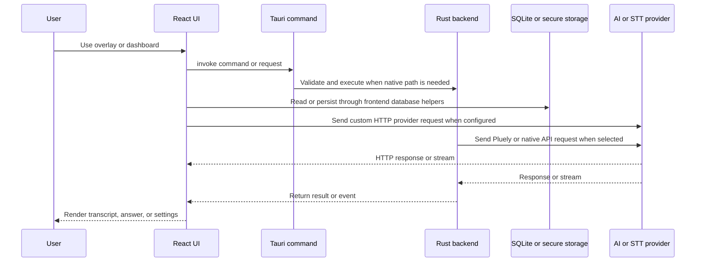

# Runtime Architecture

Interview-Pilot is a two-part desktop application. React renders the overlay and dashboard; Tauri starts the Rust backend, registers native plugins and commands, manages windows and capture, and exposes database-backed operations to the webview.

*The request path may stay in the webview for custom HTTP providers, or cross the Tauri boundary for native capture, SQLite commands, and the Pluely API path.*

## Frontend composition

`src/main.tsx` is the browser entrypoint. `src/routes/index.tsx` mounts `/` as the overlay app and wraps dashboard routes in `DashboardLayout`: `/dashboard`, `/chats`, `/system-prompts`, `/shortcuts`, `/screenshot`, `/settings`, `/audio`, `/responses`, `/dev-space`, and `/chats/view/:conversationId`. Shared state and behavior live primarily in `src/contexts/`, `src/hooks/`, and `src/lib/`.

## Backend composition

`src-tauri/src/lib.rs` is the authoritative Tauri bootstrap. It registers managed audio, capture, shortcut, license, and window state; initializes SQL, HTTP, keychain, shell, autostart, global-shortcut, PostHog, and platform-specific plugins; then exposes commands from `api`, `capture`, `speaker`, `shortcuts`, `activate`, and `window`.

The frontend calls this boundary with `@tauri-apps/api` `invoke`. Examples include `chat_stream_response`, `transcribe_audio`, `start_system_audio_capture`, `capture_to_base64`, `update_shortcuts`, and secure-storage commands. When adding a command, update both its Rust registration in `lib.rs` and the calling hook or function.

## Windows and platform behavior

`window.rs` creates and positions the overlay/dashboard windows and handles visibility and height changes. `tauri-nspanel` is enabled on macOS for panel behavior; macOS permissions and desktop autostart are conditionally initialized. Platform-specific capture and permission assumptions therefore require manual verification on the target OS, not only TypeScript checks.

The [Audio and transcription workflow](../workflows/audio-and-transcription.md) is the most stateful runtime path. It uses the backend command surface described here and persists resulting conversations through [Data and settings](../domain/data-and-settings.md).
