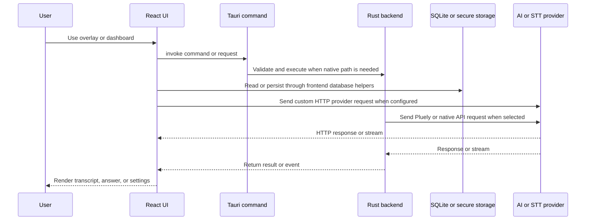

# ランタイムアーキテクチャ

Interview-Pilot は 2 つの部分で構成されるデスクトップアプリケーションです。React はオーバーレイとダッシュボードをレンダリングし、Tauri は Rust バックエンドを起動して、ネイティブプラグインとコマンドを登録し、ウィンドウとキャプチャを管理し、データベースを利用した操作を webview に公開します。

*カスタム HTTP プロバイダーの場合、リクエストパスは webview 内に留まることもあれば、ネイティブキャプチャ、SQLite コマンド、Pluely API パスの場合は Tauri 境界を越えることもあります。*

## フロントエンドの構成

`src/main.tsx` はブラウザーのエントリーポイントです。`src/routes/index.tsx` は `/` をオーバーレイアプリとしてマウントし、ダッシュボードのルートを `DashboardLayout` でラップします。対象となるルートは、`/dashboard`、`/chats`、`/system-prompts`、`/shortcuts`、`/screenshot`、`/settings`、`/audio`、`/responses`、`/dev-space`、`/chats/view/:conversationId` です。共有状態と動作は主に `src/contexts/`、`src/hooks/`、`src/lib/` に配置されています。

## バックエンドの構成

`src-tauri/src/lib.rs` は、Tauri のブートストラップにおける正式なエントリーポイントです。オーディオ、キャプチャ、ショートカット、ライセンス、ウィンドウ状態を管理対象として登録し、SQL、HTTP、キーチェーン、シェル、自動起動、グローバルショートカット、PostHog、プラットフォーム固有のプラグインを初期化してから、`api`、`capture`、`speaker`、`shortcuts`、`activate`、`window` のコマンドを公開します。

フロントエンドは `@tauri-apps/api` の `invoke` を使用してこの境界を呼び出します。例として、`chat_stream_response`、`transcribe_audio`、`start_system_audio_capture`、`capture_to_base64`、`update_shortcuts`、セキュアストレージコマンドなどがあります。コマンドを追加する場合は、`lib.rs` での Rust 登録と、それを呼び出すフックまたは関数の両方を更新してください。

## ウィンドウとプラットフォームの動作

`window.rs` はオーバーレイおよびダッシュボードのウィンドウを作成して配置し、表示状態と高さの変更を処理します。macOS ではパネル動作のために `tauri-nspanel` が有効化され、macOS の権限とデスクトップ自動起動が条件付きで初期化されます。そのため、プラットフォーム固有のキャプチャと権限に関する前提は、TypeScript のチェックだけでなく、対象 OS 上で手動検証する必要があります。

[オーディオと文字起こしのワークフロー](../workflows/audio-and-transcription.md) は、最も状態管理が複雑なランタイムパスです。このページで説明しているバックエンドのコマンドサーフェスを使用し、結果として得られた会話を[データと設定](../domain/data-and-settings.md)経由で永続化します。