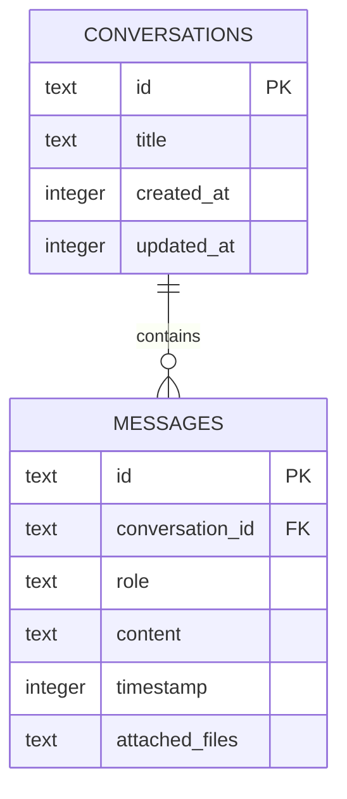

# ローカルデータと設定

このアプリはローカルファーストですが、プロバイダーから完全に分離されているわけではありません。永続的な会話とほとんどの設定はデバイス上に保持される一方、選択したプロンプト、画像、音声は設定された AI または STT サービスに送信されます。プロバイダー設定とプライバシー動作は別の関心事として扱ってください。

## 永続的なチャットとプロンプトのモデル

Tauri SQL は `sqlite:pluely.db` を初期化し、`src-tauri/src/db/migrations/` からマイグレーションを適用します。`chat-history.sql` は `conversations` と `messages` を定義します。メッセージには `user`、`assistant`、`system` のいずれかのロール、任意のシリアル化された `attached_files`、およびカスケード削除付きの外部キーがあります。インデックスは、会話の並べ替え、メッセージ検索、タイムスタンプ順序、ロールによるフィルタリングをサポートします。挿入・更新トリガーは、親会話の `updated_at` を更新します。

*永続的なチャットモデルは、順序付けられたメッセージと任意の添付ファイルメタデータを持つ会話です。*

システムプロンプトは `system-prompts.sql` によって個別に保存され、ダッシュボードページと Tauri API コマンドを通じて管理されます。`src/lib/` にある React の会話型と保存ヘルパーはフロントエンド側の表現であり、スキーマの動作についてはマイグレーションが正式な定義となります。新しいスキーマ変更は、既存のマイグレーションを書き換えるのではなく、新しいマイグレーションバージョンとして追加してください。

## セッション状態と永続化

`useSystemAudio.ts` は、`sessionTranscript`、`lastTranscription`、`sessionSummary`、および処理フラグを React の状態として保持します。音声ワークフローは最終的に会話メッセージを SQLite に保存しますが、要約の表示状態はデータベースとは独立して `startNewConversation` によってリセットされます。トランスクリプトパネルを変更する際には、この違いが重要です。表示されているセッションのトランスクリプトが、自動的に永続的な記録になるわけではありません。

## 設定と秘密情報

アプリ、応答、音声、スクリーンショット、ショートカット、プロバイダーに関する設定は、アプリコンテキスト、フック、設定ページを通じて管理されます。VAD 設定などの軽量な設定にはローカルストレージを使用します。API キーとライセンス関連の秘密情報には、利用可能な場合はキーチェーンプラグインをバックエンドとする secure-storage コマンドを使用します。これらの値をログに記録したり、文書化したりしないでください。実装には `src-tauri/src/api.rs` にライセンス関連の永続化コードも含まれているため、完全なキーチェーン保護について主張するにはエンドツーエンドの検証が必要です。

[ランタイムアーキテクチャ](../architecture/overview.md)では、コマンドとストレージの境界について説明しています。[プロバイダーとキャプチャ](../integrations/providers-and-capture.md)では、デバイス外部に送信される可能性のあるものについて説明し、[テストガイダンス](../testing/testing-guidance.md)では、このモデルを変更する際に実施すべき永続性とプライバシーのチェックを列挙しています。