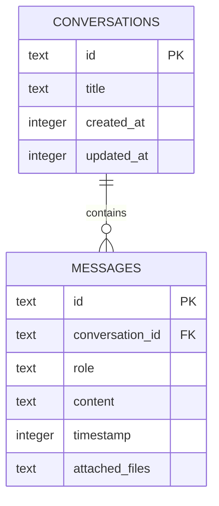

# Local Data and Settings

The app is local-first but not provider-isolated: durable conversations and most preferences remain on the device, while selected prompts, images, and audio are sent to the configured AI or STT service. Treat provider configuration and privacy behavior as separate concerns.

## Durable chat and prompt model

Tauri SQL initializes `sqlite:pluely.db` and applies migrations from `src-tauri/src/db/migrations/`. `chat-history.sql` defines `conversations` and `messages`; messages have `user`, `assistant`, or `system` roles, optional serialized `attached_files`, and a foreign key with cascade deletion. Indexes support conversation ordering, message lookup, timestamp ordering, and role filtering. Insert/update triggers advance the parent conversation's `updated_at`.

*The durable chat model is a conversation with ordered messages and optional attachment metadata.*

System prompts are stored separately by `system-prompts.sql` and managed through dashboard pages and Tauri API commands. The React conversation types and save helpers in `src/lib/` are the frontend representation; the migration remains authoritative for schema behavior. New schema changes should be added as a new migration version rather than rewriting existing migrations.

## Session state versus persistence

`useSystemAudio.ts` keeps `sessionTranscript`, `lastTranscription`, `sessionSummary`, and processing flags in React state. The audio workflow eventually saves conversation messages into SQLite, but summary display state is reset by `startNewConversation` independently of the database. This distinction matters when changing the transcript panel: a visible session transcript is not automatically a durable record.

## Settings and secrets

App, response, audio, screenshot, shortcut, and provider preferences are managed through the app context, hooks, and settings pages. Lightweight preferences such as VAD configuration use local storage. API keys and license-related secrets use secure-storage commands backed by the keychain plugin where available; do not log or document their values. The implementation also contains license-related persistence code in `src-tauri/src/api.rs`, so claims about complete keychain protection require end-to-end verification.

The [Runtime architecture](../architecture/overview.md) describes the command and storage boundary. [Providers and capture](../integrations/providers-and-capture.md) describes what can leave the device, while [Testing guidance](../testing/testing-guidance.md) lists persistence and privacy checks to perform when this model changes.