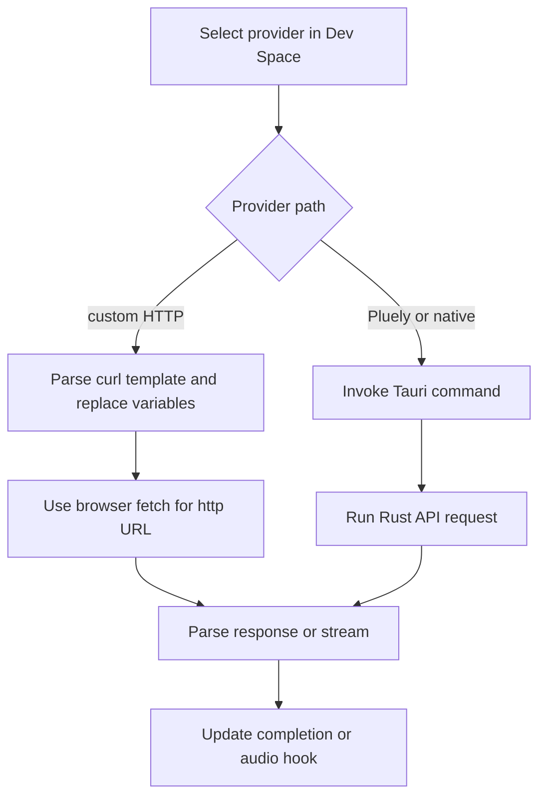

# AI, STT, and Native Capture Integrations

Provider integration is intentionally configurable. Built-in provider definitions and custom curl-style requests are surfaced through Dev Space; React functions and hooks shape requests, while the Rust API and native modules handle selected provider and capture paths.

## Provider request boundary

`src/lib/functions/ai-response.function.ts` handles custom AI templates: it expands variables, injects history and images, chooses streaming or non-streaming parsing, and extracts configured response paths. `src/lib/functions/stt.function.ts` supports multipart, binary, and JSON/base64 forms for custom STT templates. `src-tauri/src/api.rs` exposes `chat_stream_response`, `transcribe_audio`, `fetch_models`, and prompt/activity commands for the Tauri-backed path.

*Provider selection determines whether the request is assembled in the frontend or routed through a Tauri command.*

Built-in AI ecosystems include OpenAI, Anthropic, Google Gemini, xAI, Mistral, Cohere, Perplexity, Groq, OpenRouter, and Ollama. Built-in STT options include cloud Whisper-family and other providers; local engines are reachable through a compatible custom endpoint rather than a bundled Rust Whisper engine. The actual model, endpoint, credentials, request shape, and response path remain runtime configuration.

The Pluely path is separately gated by the stored enablement flag and license status (`shouldUsePluelyAPI()`), then uses Tauri commands and events such as `chat_stream_chunk` and `chat_stream_complete`. Do not assume that selecting a custom provider exercises the same code path.

## Native capture

- `src-tauri/src/capture.rs` captures screenshots and selected areas and returns base64 data to the frontend.
- `src-tauri/src/speaker/` owns system-audio capture, device enumeration, permission checks, and VAD configuration.
- `src/hooks/useSystemAudio.ts` orchestrates audio segments, STT, AI responses, summary generation, and cleanup.
- Microphone input and system audio are separate UI/settings paths even though both ultimately feed transcription.

Native permissions and audio device behavior vary by OS. Diagnose in order: device/access, capture command, transcription request, then UI state. The [Audio and transcription workflow](../workflows/audio-and-transcription.md) describes the stateful caller; [Runtime architecture](../architecture/overview.md) describes the command boundary.

Provider requests are an explicit privacy boundary: local SQLite and secure settings do not imply that audio, images, or text stay local. Review [Local data and settings](../domain/data-and-settings.md) and [Development, release, and privacy](../operations/release-and-privacy.md) before changing disclosures, telemetry, or network permissions.