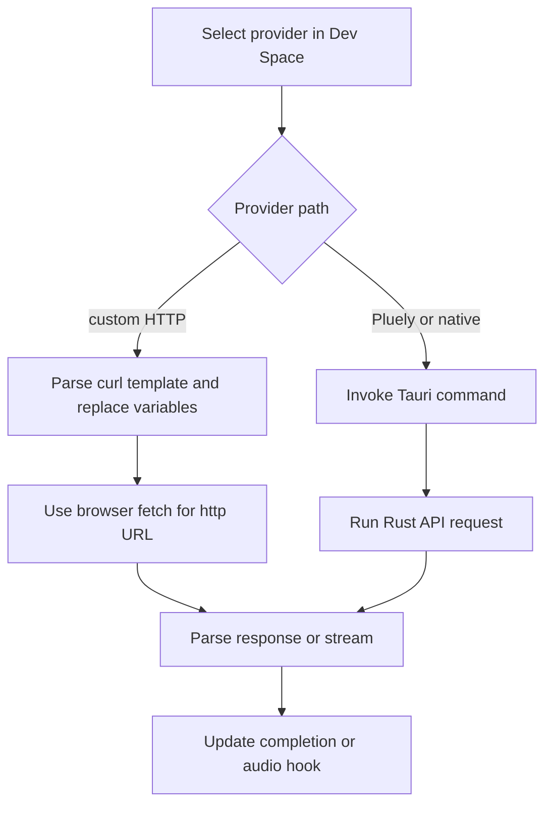

# AI、STT、ネイティブキャプチャの統合

プロバイダー統合は意図的に設定可能になっています。組み込みプロバイダー定義とカスタム curl スタイルのリクエストは Dev Space を通じて提供され、React の関数とフックがリクエストを構成し、Rust API とネイティブモジュールが選択されたプロバイダーおよびキャプチャのパスを処理します。

## プロバイダーリクエストの境界

`src/lib/functions/ai-response.function.ts` はカスタム AI テンプレートを処理します。変数を展開し、履歴と画像を注入し、ストリーミングまたは非ストリーミングの解析方式を選択して、設定されたレスポンスパスから値を抽出します。`src/lib/functions/stt.function.ts` は、カスタム STT テンプレート向けに multipart、バイナリ、JSON/base64 形式をサポートします。`src-tauri/src/api.rs` は、Tauri バックエンドのパス向けに `chat_stream_response`、`transcribe_audio`、`fetch_models`、およびプロンプト／アクティビティコマンドを公開します。

*プロバイダーの選択によって、リクエストをフロントエンドで組み立てるか、Tauri コマンド経由でルーティングするかが決まります。*

組み込み AI エコシステムには、OpenAI、Anthropic、Google Gemini、xAI、Mistral、Cohere、Perplexity、Groq、OpenRouter、Ollama が含まれます。組み込み STT オプションには、クラウド上の Whisper ファミリーやその他のプロバイダーが含まれます。ローカルエンジンは、バンドルされた Rust Whisper エンジンではなく、互換性のあるカスタムエンドポイント経由で利用できます。実際のモデル、エンドポイント、認証情報、リクエスト形式、レスポンスパスは、引き続き実行時設定です。

Pluely パスは、保存された有効化フラグとライセンス状態（`shouldUsePluelyAPI()`）によって個別に制御され、その後 `chat_stream_chunk` や `chat_stream_complete` などの Tauri コマンドとイベントを使用します。カスタムプロバイダーを選択した場合に、同じコードパスが実行されるとは限りません。

## ネイティブキャプチャ

- `src-tauri/src/capture.rs` はスクリーンショットと選択した領域をキャプチャし、フロントエンドに base64 データを返します。
- `src-tauri/src/speaker/` は、システムオーディオのキャプチャ、デバイス列挙、権限チェック、VAD 設定を担当します。
- `src/hooks/useSystemAudio.ts` は、オーディオセグメント、STT、AI レスポンス、概要生成、クリーンアップを調整します。
- マイク入力とシステムオーディオは、最終的にはどちらも文字起こしに送られますが、UI／設定上は別々のパスです。

ネイティブ権限とオーディオデバイスの動作は OS によって異なります。診断は、デバイス／アクセス、キャプチャコマンド、文字起こしリクエスト、UI 状態の順に行います。[オーディオと文字起こしのワークフロー](../workflows/audio-and-transcription.md)では状態を持つ呼び出し元について説明し、[ランタイムアーキテクチャ](../architecture/overview.md)ではコマンド境界について説明します。

プロバイダーへのリクエストは、明示的なプライバシー境界です。ローカル SQLite とセキュア設定を使用していても、オーディオ、画像、テキストがローカルに留まることを意味するわけではありません。開示内容、テレメトリ、ネットワーク権限を変更する前に、[ローカルデータと設定](../domain/data-and-settings.md)および[開発、リリース、プライバシー](../operations/release-and-privacy.md)を確認してください。