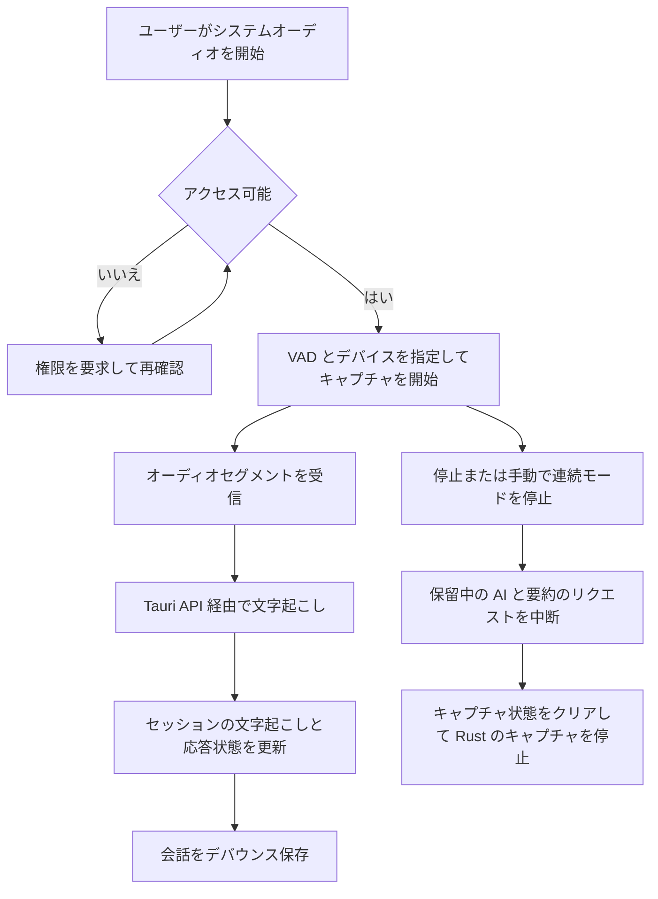

# オーディオキャプチャと文字起こしのワークフロー

`useSystemAudio.ts` は、ユーザー向けのシステムオーディオ経路を調整します。必要に応じてアクセスを要求し、出力デバイスを選択し、VAD 設定を Rust に渡し、停止時には実行中の処理を中断し、キャプチャ終了後も蓄積されたセッションの文字起こしと要約を表示し続けます。

*このワークフローはネイティブの権限状態に応じて分岐し、その後、文字起こし、UI 状態、永続化が合流します。*

## モードと状態

VAD を有効にしたキャプチャでは、セグメントが自動的に検出されます。VAD を無効にすると、フックは連続モードに入り、`manual_stop_continuous` を通じて手動の停止／送信アクションを提供します。フックは、キャプチャ、処理中、AI 処理中、セットアップが必要、エラー、ポップオーバーの各状態を追跡します。新しい会話を開始すると、会話、セッションの文字起こし、要約、処理状態がリセットされます。

停止時には `stop_system_audio_capture` を呼び出し、通常の AI リクエストと要約リクエストの両方を中断します。キャプチャ停止後もパネルを引き続き有用な状態に保てるよう、最後の文字起こし結果と AI 応答は意図的に保持します。`CONVERSATION_SAVE_DEBOUNCE_MS` による 500 ミリ秒のデバウンスにより、メッセージの変更中に保存が同時実行されることを防ぎます。

## 最近の変化

ここでは Git の履歴が重要な背景情報になります。`389382a` は STT 専用モードを導入し、`0cd3fac` はセッションの文字起こしテキストを蓄積するようにし、`8adcd54` はトップバーの要約パネルを追加しました。`openspec/changes/` と `openspec/specs/` 配下にある関連する OpenSpec 提案および同期済み仕様が、文字起こしの表示やリセットのセマンティクスを変更する前に参照すべき動作上の記録です。

UI の表示領域は `src/pages/app/components/speech/`、`TranscriptionPanel.tsx`、`SummaryPanel.tsx` に分かれており、ネイティブのキャプチャと VAD の実装は `src-tauri/src/speaker/` にあります。プロバイダー呼び出しは [ランタイムアーキテクチャ](../architecture/overview.md) で説明されているバックエンド境界を越えて実行され、生成された会話には [ローカル永続化](../domain/data-and-settings.md) が使用されます。

## 変更時の注意点

- 各対象 OS で、権限拒否とその復旧をテストする。
- アンマウント時と停止時の中断処理を維持する。そうしないと、オーディオやプロバイダーの処理がオーバーレイの終了後も存続する可能性がある。
- セッション限定の文字起こし状態と、永続化された会話メッセージを区別する。
- VAD 設定を変更する場合は、ローカルストレージと Rust の `update_vad_config` コマンドの両方を更新する。