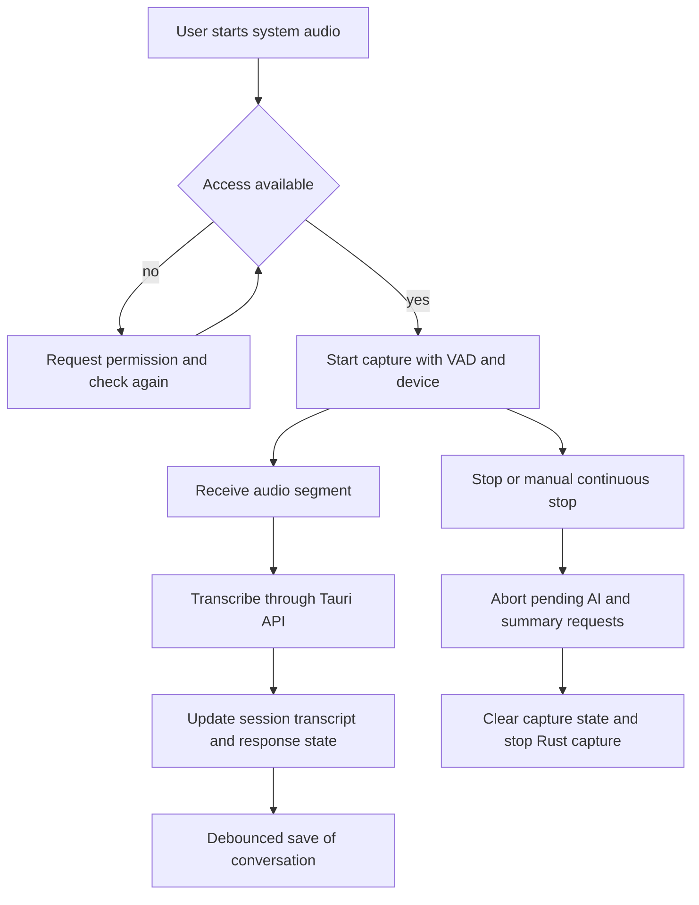

# Audio Capture and Transcription Workflow

`useSystemAudio.ts` coordinates the user-facing system-audio path. It requests access where needed, selects an output device, passes VAD configuration to Rust, aborts in-flight work on stop, and keeps the accumulated session transcript and summary visible after capture ends.

*The workflow branches on native permission state, then joins transcription, UI state, and persistence.*

## Modes and state

VAD-enabled capture detects segments automatically. When VAD is disabled, the hook enters continuous mode and exposes a manual stop/send action through `manual_stop_continuous`. The hook tracks capture, processing, AI processing, setup-required, error, and popover state. Starting a new conversation resets the conversation, session transcript, summary, and processing state.

Stopping calls `stop_system_audio_capture` and aborts both the ordinary AI request and summary request. It intentionally retains the last transcription and AI response so the panel can remain useful after capture stops. A 500 ms debounce (from `CONVERSATION_SAVE_DEBOUNCE_MS`) avoids concurrent saves while messages are changing.

## Recent evolution

Git history is important context here: `389382a` introduced STT-only mode, `0cd3fac` accumulated session transcript text, and `8adcd54` added the top-bar summary panel. The associated OpenSpec proposals and synchronized specs under `openspec/changes/` and `openspec/specs/` are the behavioral record to consult before changing transcript display or reset semantics.

The UI surface is split across `src/pages/app/components/speech/`, `TranscriptionPanel.tsx`, and `SummaryPanel.tsx`; native capture and VAD implementation is under `src-tauri/src/speaker/`. Provider calls cross the backend boundary described in [Runtime architecture](../architecture/overview.md) and resulting conversations use [local persistence](../domain/data-and-settings.md).

## Change hazards

- Test permission denial and recovery on each target OS.
- Preserve abort cleanup on unmount and stop; otherwise audio or provider work can outlive the overlay.
- Keep session-only transcript state distinct from persisted conversation messages.
- Changes to VAD config must update both local storage and the Rust `update_vad_config` command.
